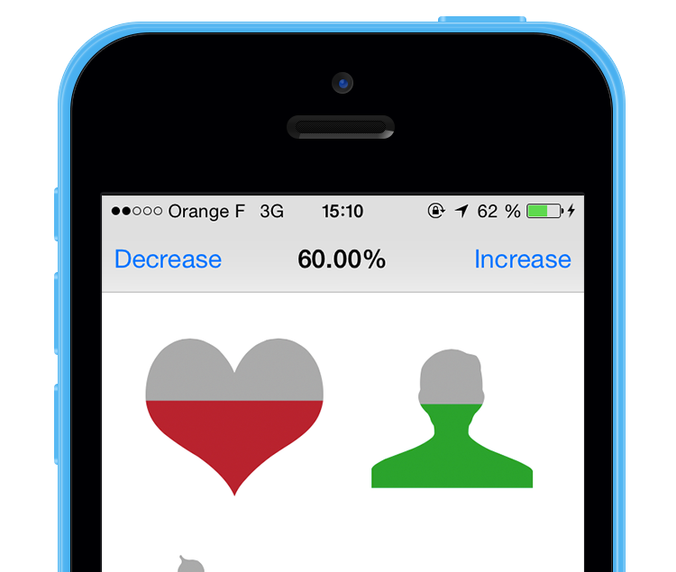
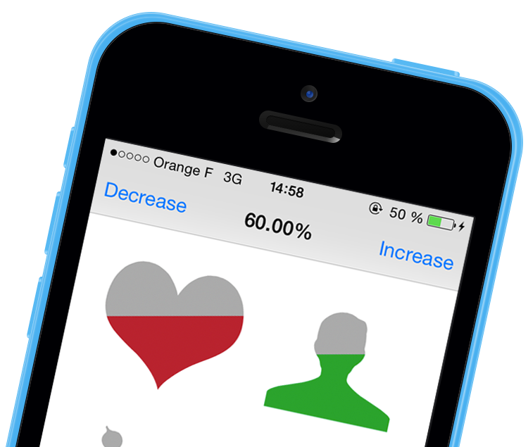

# DPMeterView
**Presents values in a custom gauge-style meter view with delightful animations**

> It should be easy to fill a shape with a color, to visually reflect a percentage.

There is plenty of examples where it can be useful: 

* simple progress bar view
* stars rating view
* emotion view
* trend value view

## CocoaPods

> Instead of adding the source files directly to your project, you may want to consider using [CocoaPods](http://cocoapods.org/) to manage your dependencies. Follow the instructions on the CocoaPods site to install the gem, and specify DPMeterView as a dependency in your `Podfile` with

```ruby
pod 'DPMeterView', '0.0.1'
```

## Run the Demo

Clone the repo and install CocoaPods dependencies.

```sh
$ git clone https://github.com/dulaccc/DPMeterView.git
$ cd DPMeterView/Example
$ pod install
$ open Example.xcworkspace
```

Then select the correct active scheme `Example` (if something else like `Pod` or `Pod-DPMeterViewTests` was selected).
And your good to run the app on the Simulator or a Device.



## Usage

```objective-c
#import "DPMeterView.h"
#import "UIBezierPath+BasicShapes.h"

DPMeterView *fiveStarsShape = [[DPMeterView alloc] initWithFrame:CGRectMake(0, 0, 200, 40)];
[fiveStarsShape setMeterType:DPMeterTypeLinearHorizontal];
[fiveStarsShape setShape:[UIBezierPath stars:5 shapeInFrame:fiveStarsShape.bounds].CGPath];
```

#### setProgress:animated:

```objective-c
[fiveStarsShape setProgress:0.6 animated:YES];
```

And a nice animation will update the view.

### Custom shapes

> Not a single image pixel !

In the example above I'm just using a `UIBezierPath` that is included in the category `UIBezierPath+BasicShapes`. Feel free to fork the project and add other shapes you think it'd be great to have.

You can use any shape you want, the class `DPMeterView` uses the `CGPath` as a mask.

### Gravity aware



> to try this feature you need to run the `Example` project on a device because the simulator doesn't provide `CoreMotion` acceleration data.

#### startGravity

```objective-c
[fiveStarsShape startGravity];
```
#### stopGravity

```objective-c
[fiveStarsShape stopGravity];
```

## Minor known issues

* Don't use `initWithFrame:` on the `0.0.1` version otherwise the `commonInit` method won't be called. Instead, use the `initWithFrame:shape:` or `init` and then `setShape:`
* The `yaw` obtained from the `CoreMotion` acceleration quaternion is restrained to the interval `[-PI/2, PI/2]`, because of the definition of `arcsin` used to compute it. It would be even better if we find a way to extend it to the complete interval `[-PI, PI]`, but I'm not a "quaternion master" ^^ 
* There will be some boudary issues with gradients that have an oriented angle other that a vertical or an horizontal one. Especially, a `DPMeterView` shape can be entirely filled whereas it is not at a 100% progression, depends on the shape… 

## Roadmap / Evolutions
 
* Have a `progressTintColor` that can evolve with the `progress` value, like in a [heat map scale](http://www.energyvanguard.com/Portals/88935/images/home-energy-rating-hers-index-scale-resized-600.jpg).
* Use an image for the mask instead of a CGPath, but I don't know how to achieve that.
* I'd like to add a little utility that enables developers to load shapes from  a `.svg` file into a `UIBezierPath` directly, avoiding the burden of creating a UIBezierPath by hand. (the current work around is to use the great [PaintCode](http://www.paintcodeapp.com/) application)

## Contact

[Pierre Dulac](http://github.com/dulaccc)  
[@dulaccc](https://twitter.com/dulaccc)

## License
DPMeterView is available under the MIT license. See the LICENSE file for more info.